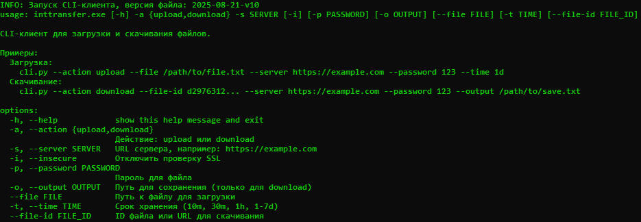

# intTransfer CLI - специальный клиент для консольных систем

<p align="center">
  
</p>

## Особенности
- Передача и скачивание файлов
- Возможность указать пароль `(необязательно)`
- Возможность указать срок хранения файла `от 10 минут до недели`

## Примеры комманд

### Для загрузки

```bash
inttransfer -a upload --file <путь к файлу> -s https://example.com -p <пароль> -t 7d
```

### Для скачивания

```bash
inttransfer -a download --file-id <id файла из ссылки> -s https://example.com  -p <пароль> -o <путь для сохранения>
```